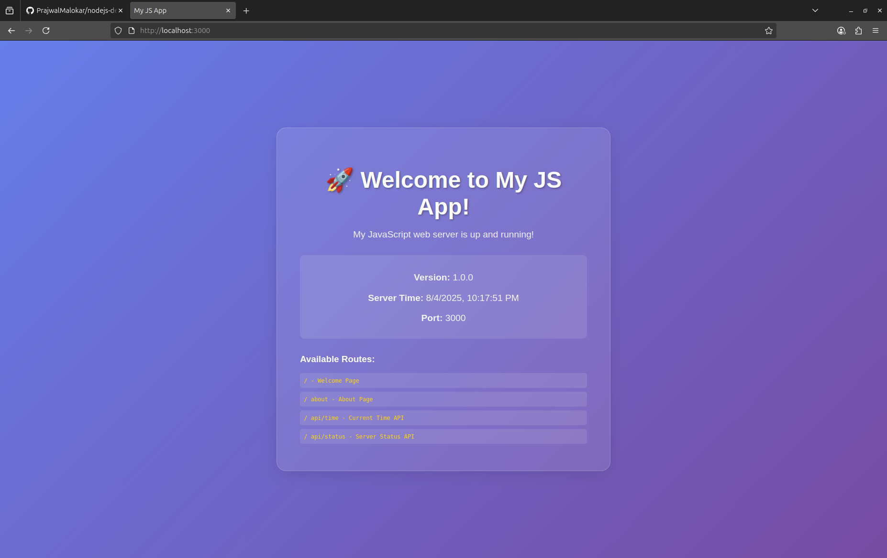

# Node.js Demo App 🚀

A simple Node.js web server application that demonstrates basic HTTP server functionality with modern UI and API endpoints.

## Features ✨

- **Beautiful Web Interface** - Modern glassmorphism design with gradient backgrounds
- **Multiple Routes** - Home, About, and API endpoints
- **JSON APIs** - Time and status endpoints for integration
- **Docker Support** - Containerized deployment ready
- **Test Suite** - Comprehensive testing with Jest and Supertest
- **Graceful Shutdown** - Proper server lifecycle management

## Screenshots 📸

### Welcome Page
- Modern glassmorphism design
- Server information display
- Available routes navigation



### API Endpoints
- `/api/time` - Current timestamp and timezone info
- `/api/status` - Server status and system information

## Installation 🛠️

### Prerequisites
- Node.js (version 14 or higher)
- npm (comes with Node.js)

### Local Development

1. **Clone the repository**
   ```bash
   git clone https://github.com/PrajwalMalokar/nodejs-demo-app.git
   cd nodejs-demo-app
   ```

2. **Install dependencies**
   ```bash
   npm install
   ```

3. **Start the server**
   ```bash
   npm start
   ```

4. **Open your browser**
   ```
   http://localhost:3000
   ```

## Usage 🌐

### Available Routes

| Route | Method | Description |
|-------|--------|-------------|
| `/` | GET | Welcome page with app information |
| `/about` | GET | About page with project details |
| `/api/time` | GET | JSON response with current time |
| `/api/status` | GET | JSON response with server status |

### API Examples

**Get Current Time**
```bash
curl http://localhost:3000/api/time
```

Response:
```json
{
  "timestamp": "2025-08-04T10:30:00.000Z",
  "localTime": "8/4/2025, 10:30:00 AM",
  "timezone": "UTC"
}
```

**Get Server Status**
```bash
curl http://localhost:3000/api/status
```

Response:
```json
{
  "status": "running",
  "appName": "My JS App",
  "version": "1.0.0",
  "uptime": 123.45,
  "port": 3000,
  "nodeVersion": "v18.19.1"
}
```

## Docker Deployment 🐳

### Build and Run with Docker

1. **Build the Docker image**
   ```bash
   docker build -t nodejs-demo-app .
   ```

2. **Run the container**
   ```bash
   docker run -p 3000:3000 nodejs-demo-app
   ```

3. **Access the application**
   ```
   http://localhost:3000
   ```

### Docker Compose (Optional)

Create a `docker-compose.yml` file:
```yaml
version: '3.8'
services:
  app:
    build: .
    ports:
      - "3000:3000"
    environment:
      - NODE_ENV=production
```

Run with:
```bash
docker-compose up
```

## Testing 🧪

The project includes comprehensive tests using Jest and Supertest.

### Run Tests
```bash
npm test
```

### Test Coverage
- API endpoint functionality
- Response status codes
- JSON response structure
- Server lifecycle management

## Project Structure 📁

```
nodejs-demo-app/
├── main.js              # Main server application
├── main.test.js         # Test suite
├── package.json         # Project configuration
├── Dockerfile          # Docker configuration
└── README.md           # This file
```

## Development 👨‍💻

### Adding New Routes

1. Open `main.js`
2. Add a new case in the switch statement:
   ```javascript
   case '/new-route':
       res.statusCode = 200;
       res.end('Your content here');
       break;
   ```

### Environment Variables

The app uses these default values:
- **Port**: 3000
- **App Name**: "My JS App"
- **Version**: "1.0.0"

You can modify these in the `main.js` file or set environment variables.

## Contributing 🤝

1. Fork the repository
2. Create a feature branch (`git checkout -b feature/amazing-feature`)
3. Commit your changes (`git commit -m 'Add amazing feature'`)
4. Push to the branch (`git push origin feature/amazing-feature`)
5. Open a Pull Request

## License 📄

This project is licensed under the ISC License - see the [LICENSE](LICENSE) file for details.

## Author 👤

**Prajwal Malokar**
- GitHub: [@PrajwalMalokar](https://github.com/PrajwalMalokar)

## Acknowledgments 🙏

- Built with Node.js built-in HTTP module
- Modern CSS with glassmorphism design
- Docker for containerization
- Jest for testing framework

## Support 💬

If you have any questions or need help, please open an issue on GitHub.

---

⭐ **Star this repository if you found it helpful!**
